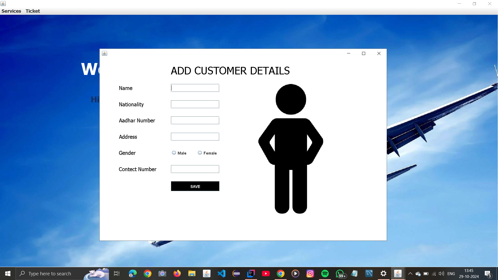

# Airline Management System

An **Airline Management System** built with Java, Swing for GUI, and MySQL/MariaDB for database management. This project allows users to book flights, view available flights, and manage user information efficiently.

## Table of Contents
- [Features](#features)
- [Screenshots](#screenshots)
- [Database Schema](#database-schema)
- [Technologies Used](#technologies-used)
- [Setup](#setup)
- [Usage](#usage)
- [License](#license)

## Features

1. **User Authentication**:
   - Secure login system with JDBC connection for verifying user credentials.

2. **Passenger Information Management**:
   - Fetch and display passenger details such as name, address, gender, and nationality using the Aadhar number.

3. **Flight Search and Booking**:
   - Search for flights based on source and destination.
   - Display flight name and flight code.
   - Book a flight with automatic PNR and ticket number generation.
   - Confirmation message displaying the PNR after booking.

4. **Date Selection**:
   - JDateChooser component for easy date selection while booking flights.

5. **Admin Panel** (if applicable):
   - Manage flight details such as source, destination, flight name, and flight code.

## Screenshots

### Home Screen


### Add Customer Details


### Book Flight 


### Flight Cancellation
.png)

### Boarding Pass


## Database Schema

### Passenger Table
| Column       | Type         | Description                  |
|--------------|--------------|------------------------------|
| aadhar       | VARCHAR(15)  | Primary Key (Aadhar Number)  |
| name         | VARCHAR(50)  | Passenger's Name            |
| address      | VARCHAR(100) | Passenger's Address         |
| nationality  | VARCHAR(30)  | Passenger's Nationality     |
| gender       | VARCHAR(10)  | Passenger's Gender          |

### Flight Table
| Column       | Type         | Description                  |
|--------------|--------------|------------------------------|
| flight_code  | VARCHAR(10)  | Primary Key (Flight Code)    |
| flight_name  | VARCHAR(50)  | Name of the Flight          |
| source       | VARCHAR(50)  | Source Location             |
| destination  | VARCHAR(50)  | Destination Location        |

### Reservation Table
| Column       | Type         | Description                      |
|--------------|--------------|----------------------------------|
| pnr          | VARCHAR(20)  | Primary Key (PNR Number)         |
| ticket_no    | VARCHAR(20)  | Ticket Number                    |
| aadhar       | VARCHAR(15)  | Foreign Key (Passenger Aadhar)   |
| name         | VARCHAR(50)  | Passenger's Name                |
| nationality  | VARCHAR(30)  | Passenger's Nationality         |
| flight_name  | VARCHAR(50)  | Name of the Flight              |
| flight_code  | VARCHAR(10)  | Flight Code                     |
| source       | VARCHAR(50)  | Source Location                 |
| destination  | VARCHAR(50)  | Destination Location            |
| date         | DATE         | Date of Travel                  |

## Technologies Used
- **Programming Language**: Java
- **GUI Framework**: Swing, Awt
- **Database**: MySQL/MariaDB
- **Other Tools**: JDBC, JDateChooser for date selection

## Setup

1. Clone this repository to your local machine.
   ```bash
   git clone https://github.com/shivendrasis/airline-management-system.git

2. Import the project in your preferred Java IDE (e.g., IntelliJ IDEA or Eclipse).

3. Set up the MySQL database:

   - Import the SQL file provided in database/airline_management.sql to create the required tables and schema.
4. Update the JdbcConnection class with your database credentials.

5. Run the BookFlight.java file to start the application.


## Usage
- **Book a Flight**: Enter Aadhar number, fetch user data, select source and destination, choose a travel date, and book the flight.
- **View Flights**: Search available flights based on selected source and destination.
- **Admin Management (if applicable)**: Use an admin panel to add, update, or delete flights.
  
## License
**This project is licensed under the MIT License. See the LICENSE file for details.**


